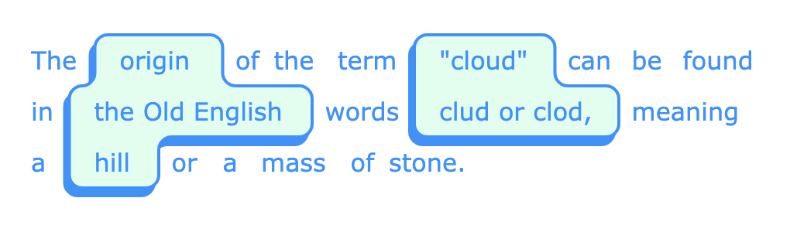

# react-cloud-letter



[](https://www.npmjs.com/package/react-cloud-letter)


React-based, typed component wraps your (whole or certain pieces of) letter in auto-merged cloud-like shape. Created with respect to [polygon-clipping](https://github.com/mfogel/polygon-clipping) implementation of the Martinez-Rueda-Feito polygon clipping algorithm, and with a little help from my [round-polygon](https://github.com/foretoo/round-polygon) tool.

</br>

- ### [No-code demo](https://foretoo.github.io/react-cloud-letter)
- ### [Codesandbox demo](https://codesandbox.io/s/react-cloud-letter-demo-wbt3yc?file=/src/App.js)

</br>

## Installation

by npm:
```
npm i react-cloud-letter
```

</br>

## Example of usage

```jsx
import { CloudLetter } from "react-cloud-letter"

export const App = () => {
  const content = "The ${origin} of the term ${'cloud'} can be found\nin ${the Old English} words ${clud or clod,} meaning\na ${hill} or a mass of stone."

  return (
    <CloudLetter
      width={Math.min(window.innerWidth * 0.8, 512)}
      spaceWidth={1}
      cloudHeight={32}
      font={{ family: "Verdana" }}
      mode="PARTIAL"
      snap={4}
      fill="#dfe"
    >
      {content}
    </CloudLetter>
  )
}
```

</br>

## Types
the package contains type declarations (.d.ts-files), but in case you would like to be more explicit, import `CloudLetterProps` in addition
```javascript
import { CloudLetter, CloudLetterProps } from "react-cloud-letter"
```

</br>

## Interface
all params are optional

| name | type | default | description |
|---|---|---|---|
| children | string \| JSX.Element | null | might be a pure string or a string combined with a CloudWord components (description in a mode option) |
| width | number | 360 | width of the CloudLetter element in px |
| spaceWidth | number | 32 | width of spaces between words in px |
| cloudHeight | number | 32 | height of words/spaces/clouds in px |
| padding | number | 16 | horizontal padding of words/clouds in px |
| radius | number | 0.25 | ratio to the cloudHeight, expected range is 0 to 0.5 |
| mode | "WORD" \| "PARTIAL" \| "SPACE" | "WORD" | elements you whant to wrap. "PARTIAL" works with wrapped in ${...} text parts (see example above and demo), alternatively you can wrap text parts in CloudWord components, which you may import in addition to the CloudLetter component |
| align | "left" \| "center" \| "right" | "left" | text/clouds horizontal aligning inside the CloudLetter element |
| snap | number | 0 | will snaps all elements to a grid defined by ratio of cloudHeight / snap if snap > 0 |
| grid | boolean | false | debugger, to see the grid defined by the snap option |
| fill | [CSS Color](https://developer.mozilla.org/en-US/docs/Web/CSS/color_value) | "white" | clouds will be filled with color provided |
| stroke | [CSS Color](https://developer.mozilla.org/en-US/docs/Web/CSS/color_value) | "dodgerBlue" | color of clouds stroke |
| strokeWidth | number | 2 | stroke width in px |
| shadowOffsetX | number | -3 | shadow offset on X-axis in px |
| shadowOffsetY | number | 5 | shadow offset on Y-axis in px |
| shadowColor | [CSS Color](https://developer.mozilla.org/en-US/docs/Web/CSS/color_value) | stroke | color of shadow, by default takes color of stroke option |
| font | object | see below | an object with font CSS rules |

### font options

all params are optional

| name | type | default | description |
|---|---|---|---|
| color | [CSS Color](https://developer.mozilla.org/en-US/docs/Web/CSS/color_value) | stroke | text color, by default takes color of stroke option |
| family | string | "sans-serif" | font-family CSS rule |
| size | number | 16 | font-size CSS rule in px |
| style | string | "none" | font-style CSS rule |
| variant | string | "none" | font-variant CSS rule |
| weight | string | "none" | font-weight CSS rule |
| stretch | string | "normal" | font-stretch CSS rule |

</br>