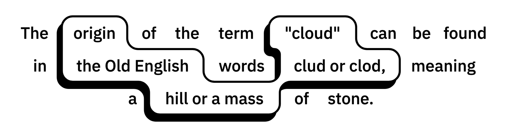

# react-cloud-letter



React-based, typed component wraps your (whole or certain pieces of) letter in auto-merged cloud-like shape. Created with respect to [polygon-clipping](https://github.com/mfogel/polygon-clipping) implementation of the Martinez-Rueda-Feito polygon clipping algorithm.

### [Demo page](https://foretoo.github.io/cloud-letter)

v0.2.2
</br>

```typescript
CloudLetterProps = {
  children: JSX.Element | string | (string | JSX.Element)[] | null,
  width?: number = 360,
  spaceWidth?: number = 32,
  cloudHeight?: number = 32,
  padding?: number = 16,
  radius?: number = 0.25,

  mode?: "WORD" | "PARTIAL" | "SPACE" = "WORD",
  align?: "left" | "center" | "right" = "left",
  snap?: number = 4,
  grid?: boolean = false,

  fill?: string = "white",
  stroke?: string = "dodgerBlue",
  strokeWidth?: number = 2,
  shadowOffsetX?: number = -3,
  shadowOffsetY?: number = 5,
  shadowColor?: string = stroke,

  font?: {
    color?: string = stroke,
    family?: string = 16,
    size?: number = "sans-serif",
    style?: string = "none",
    variant?: string = "none",
    weight?: string = "none",
    stretch?: string = "normal",
  },
}
```